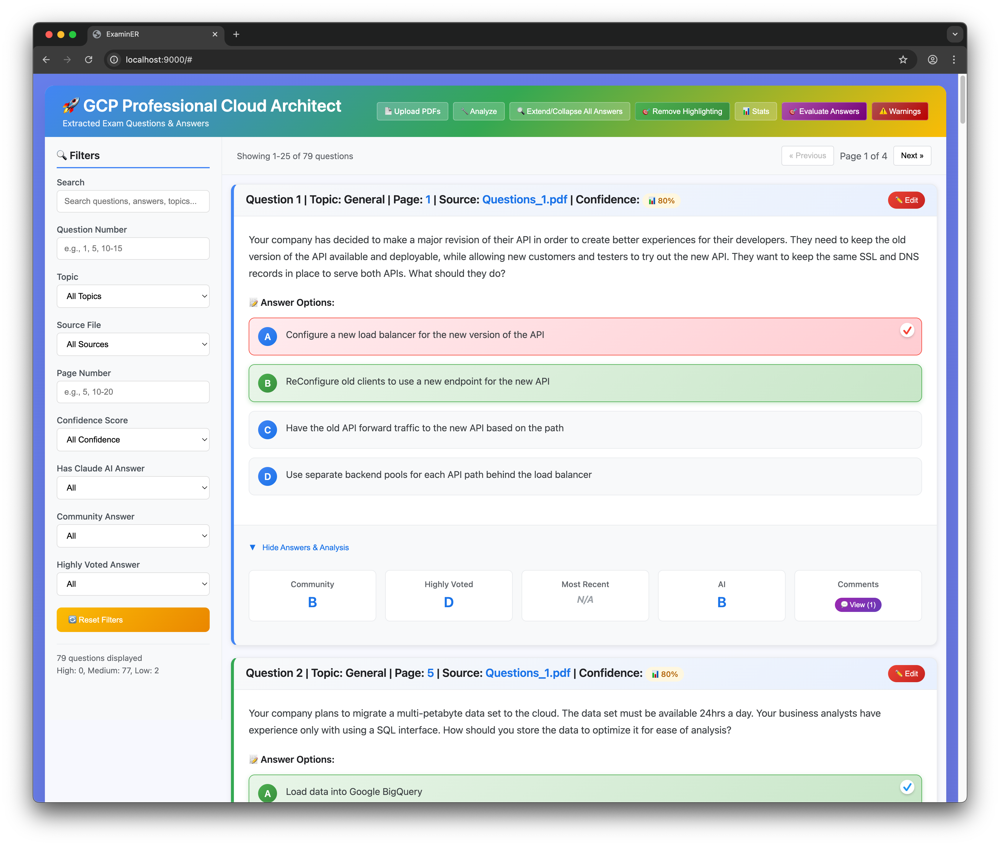

# ExaMiner

A comprehensive solution for extracting, parsing, and analyzing certification exam questions, answers and comments provided by community as PDF documents with LLM-powered analysis and turn into an interactive web interface.

## 🚀 Features

### Core Processing
- **PDF Processing**: Extract text from multiple PDF files with intelligent question boundary detection
- **Question Parsing**: Parse question structures, answer options, and community responses  
- **LLM Analysis**: Real-time Claude AI analysis for expert-level answer determination
- **Text Enhancement**: Advanced OCR error correction and text cleaning
- **Auto-increment Numbering**: Unique primary key system for all questions
- **Multiple Output Formats**: CSV, Markdown Tables, JSON Data, Clean JSON format for Web UI

### Interactive Web UI
- **🔍 Smart Search & Filtering**: Search across all content with multiple filter options
- **📝 Answer Marking**: Mark your answers with persistent storage across sessions
- **✨ Answer Highlighting**: Show/hide correct answers with visual indicators
- **📊 Exam Evaluation**: Comprehensive scoring system with 70% GCP passing threshold
- **📈 Detailed Analytics**: Wrong answer review, skipped questions tracking
- **✏️ Question Editing**: Edit questions, answers, and mark correct solutions
- **⚠️ Quality Warnings**: Comprehensive extraction warnings with verbose error analysis and clickable navigation



## 📁 Project Structure

```
examiner/
├── src/                          # Core application modules
│   ├── robust_question_parser.py # Main extraction script
│   ├── pdf_processor.py          # PDF text extraction and processing
│   ├── question_parser.py        # Question structure parsing
│   ├── llm_integrator.py         # Claude API integration
│   ├── text_enhancer.py          # Text cleaning and enhancement
│   └── output_generator.py       # Output generation (CSV/MD/JSON)
├── config/                       # Configuration files
│   ├── api_config.json          # Claude API configuration
│   ├── processing_config.json   # Processing parameters
│   └── prompts.json            # LLM prompt templates
├── data/
│   ├── input/                   # Source PDF files
│   └── output/                  # Generated output files
├── web_ui/                      # Interactive web interface
│   └── index.html              # Main web UI application
├── logs/                        # Application logs
├── tests/                       # Test files
├── samples/                     # Sample PDF files for testing
└── assets/                      # Screenshots and documentation images
```

## 🛠️ Installation

1. **Clone the repository**:
   ```bash
   git clone https://github.com/fxerkan/examiner.git
   cd examiner
   ```

2. **Create virtual environment**:
   ```bash
   python3 -m venv venv
   source venv/bin/activate  # On Windows: venv\Scripts\activate
   ```

3. **Install dependencies**:
   ```bash
   pip install -r requirements.txt
   ```

4. **Configure Claude API**:
   - Open `config/api_config.json`
   - Add your Claude API key
   ```json
   {
     "claude": {
       "api_key": "your-claude-api-key-here"
     }
   }
   ```

## 🚀 Quick Start

### Method 1: Manual Processing (Recommended)

1. **Place PDF files** in `data/input/` directory:
   ```
   data/input/
   ├── Questions_1.pdf
   ├── Questions_2.pdf
   └── Questions_3.pdf
   ```

2. **Run the extractor**:
   ```bash
   source venv/bin/activate
   python src/robust_question_parser.py
   ```

3. **Start web UI**:
   ```bash
   cd web_ui
   python -m http.server 9000
   ```
   
4. **Open browser**: [http://localhost:9000](http://localhost:9000)

### Future Feature: PDF Upload Interface
PDF upload functionality is currently in development and temporarily disabled in the web interface. Manual file placement method above is the current supported workflow.

## 🔧 Command Line Usage

```bash
# Run the main extraction process
python src/robust_question_parser.py

# Alternative: Use main.py (legacy)
python src/main.py
```

## 📊 Quality Assurance

The extractor includes comprehensive quality control:

- **Confidence Scoring**: Each question gets a confidence score based on completeness
- **Duplicate Detection**: Identifies potential duplicate questions
- **Error Tracking**: Comprehensive logging and error reporting
- **Data Validation**: Input validation and structure checking

### Sample Quality Metrics

```
📊 Processing Summary:
- Total Questions: 150
- High Confidence (≥0.8): 142 (94.7%)
- Medium Confidence (0.5-0.8): 6 (4.0%)
- Low Confidence (<0.5): 2 (1.3%)
- Claude Analysis Success: 148 (98.7%)
- Potential Duplicates: 3 pairs identified
```

## 🧪 Testing

```bash
# Run basic project tests  
python tests/test_basic_functionality.py

# Check specific module
python -c "from src.question_parser import QuestionParser; print('✅ Import successful')"
```

## 🐛 Troubleshooting

### Common Issues

1. **PDF Processing Errors**:
   - Ensure PDF files are not password-protected
   - Check file permissions
   - Verify PDF files are text-based (not scanned images)

2. **Claude API Issues**:
   - Verify API key in `config/api_config.json`
   - Check rate limits and quotas
   - Ensure internet connection

3. **Web UI Not Loading**:
   - Ensure `data/output/questions_web_data.json` exists
   - Check browser console for JavaScript errors
   - Verify local server is running

### Logging

Check logs in `logs/examiner_processor.log` for detailed error information:

```bash
tail -f logs/examiner_processor.log
```

## 🎯 Example Output

The system processes questions like this:

**Input (from PDF)**:
```
Question #1 Topic 1

Your company wants to migrate a large, monolithic application to Google Cloud Platform...

A. Rehost (Lift and Shift) the entire application to Compute Engine
B. Refactor the application into microservices and deploy on GKE
C. Rebuild the application as a serverless solution using Cloud Functions
D. Replace with SaaS solutions wherever possible

Selected Answer: A
Highly Voted: A  
Most Recent: B
```

**Output (Structured)**:
- ✅ **Question ID**: Q1_1
- 📝 **Description**: Clean, enhanced question text
- 🔤 **Options**: A, B, C, D with full text
- 👥 **Community**: A (Highly Voted: A, Most Recent: B)  
- 🤖 **Claude AI**: B (with detailed reasoning)
- 🎯 **Confidence**: 0.95 (High)
- 📍 **Metadata**: Topic 1, Page 12, Questions_1.pdf


## 📜 License

This project is provided as-is for educational and professional development purposes.

## 🙏 Acknowledgments

### AI Assistant & Development Tools
- **[Claude Code](https://claude.ai/code)** - Primary AI assistant for development
- **[Anthropic Claude](https://www.anthropic.com)** - LLM integration for question analysis
- **[Claude Sonnet 4](https://www.anthropic.com)** - Advanced reasoning and code generation

### MCP Agents & Specialized Tools
- **Playwright MCP** - Browser automation and web UI testing
- **General-Purpose Agent** - Complex task orchestration and multi-step workflows
- **Code-Reviewer Agent** - Code quality analysis and review
- **Test-Automator Agent** - Test suite creation and automation infrastructure

### Data Source
- **[ExamTopics](https://www.examtopics.com)** - Community-driven exam questions and discussions

### Technologies & Libraries
- **Python** - Core application development
- **JavaScript/HTML/CSS** - Interactive web interface
- **PDF Processing** - Text extraction and parsing
- **JSON/CSV** - Data serialization and export formats

---

**Developed with ❤️ and 🤖 (Claude Code) 🚀**